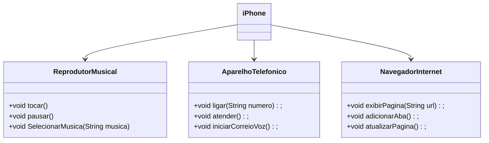

```mermaid
classDiagram
    class ReprodutorMusical {
        +void tocar()
        +void pausar()
        +void SelecionarMusica(String musica)
    }

    class AparelhoTelefonico {
        +void ligar(String numero);
        +void atender();
        +void iniciarCorreioVoz();
    }

    class NavegadorInternet {
        +void exibirPagina(String url);
        +void adicionarAba();
        +void atualizarPagina();
    }

    class iPhone {
    }

    iPhone --> ReprodutorMusical
    iPhone --> AparelhoTelefonico
    iPhone --> NavegadorInternet
```
